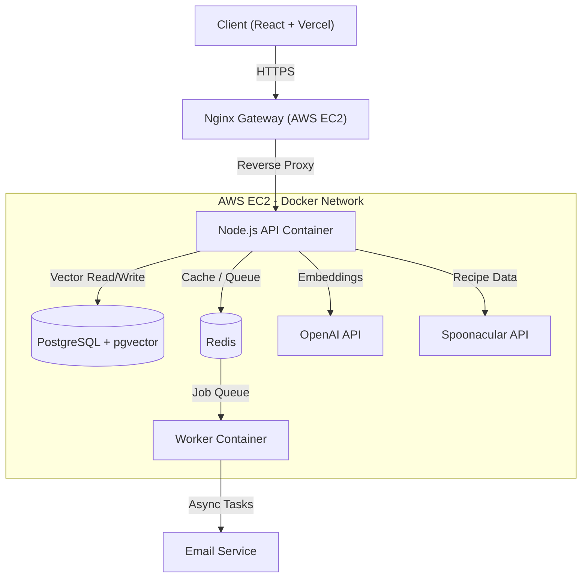

# Meal Match 🥘

A **distributed, containerized, AI-powered Full Stack application** for recipe management, deployed on **AWS EC2**.

**Meal Match** is a production-grade web application that allows users to find recipes using natural language, ingredients, and semantic context. This project focuses on **backend scalability, DevOps automation, and AI-driven Search**.

🚀 **Live Demo:** [https://meal-match-kappa.vercel.app/](https://meal-match-kappa.vercel.app/)


---

## 🏗 System Architecture

The application implements a **Microservices-lite architecture** using **Docker Compose**.  
It separates the high-throughput API from background worker processes and utilizes **PostgreSQL with pgvector** for hybrid keyword/semantic search.

### Architecture Diagram (Mermaid)

## 🛠 Tech Stack

**Frontend:** React, TypeScript, TailwindCSS, Vite (Deployed on Vercel)

**Backend:** Node.js, Express, TypeScript (Deployed on AWS EC2)

**Database:** PostgreSQL (**pgvector** extension for embeddings), Redis (Caching & Queues)

**AI & Search:** OpenAI (Text Embeddings), Vector Similarity Search, Hybrid Filtering

**Infrastructure:** Docker, Docker Compose, Nginx (Reverse Proxy), Linux (Ubuntu)

**DevOps:** GitHub Actions (CI/CD), Certbot (SSL)

---

## 🌟 Key Engineering Features
### 1. AI-Powered Natural Language Processing (NLP)
Users can search using complex, unstructured sentences. The backend utilizes **Generative AI (LLM)** to parse user intent into structured data.

- **Input:** *"I want an Asian-style pasta recipes that are ready in under 60 minutes and have fewer than 500 calories."*

- **AI Processing:** Converts text into a structured JSON query object.

- **Output:** Database executes a precise filter for `{ query: "pasta", cuisine: "asian", maxReadyTime: 60, maxCalories: 500 }`.

### 2. Semantic Vector Search
Unlike traditional keyword matching, Meal Match utilizes **vector embeddings** to find recipes that are conceptually similar, even if they don't share the exact same words.

- **Embeddings:** Recipe data is converted into high-dimensional vectors when user saves a recipe to their favorites.

- **Vector Database:** Vectors are stored in PostgreSQL using the `pgvector` extension for high-performance similarity search.

### 3. Distributed Caching (Redis)
To reduce latency and external API costs, search results from Spoonacular are cached in Redis with a TTL (Time-To-Live).

**Result:** API response time reduced from ~400ms to ~5ms for frequent queries.

---

### 4. Asynchronous Background Jobs (BullMQ)
Heavy operations (like sending welcome emails) are offloaded to a background worker using a message queue.

**Result:** User registration is instantaneous; the API does not block while waiting for email service providers.

**Resilience:** If the Worker crashes, jobs persist in Redis and are retried automatically.

---

### 5. Rate Limiting & Security
**Fixed Window Counter:** Custom middleware limits requests per IP using Redis atomic increments to prevent abuse.

**Security:** JWT Authentication, BCrypt password hashing, and Environment Variable injection via Docker.

---

### 6. Containerization & DevOps
**Docker Compose:** Orchestrates 4 services (API, Worker, DB, Redis) with a single command.

**Multi-Stage Builds:** Dockerfiles use multi-stage builds to create lightweight production images.

**CI Pipeline:** GitHub Actions automatically verifies build integrity on every push.

---

## 🚀 How to Run Locally

**Prerequisites:**
- Docker Desktop
- Spoonacular API key
- OpenAI API key (billing enabled)
- Gmail account + App Password (for Nodemailer)

### 1. Clone the Repository

```bash
git clone https://github.com/ankhanhdau/meal-match.git
cd meal-match
```
### 2. Configure Environment Variables
Create a `.env` file in the root directory based on the provided `.env.example`.

### 3. Start Services
```bash
docker compose up -d --build
```
### 4. Access the App
Frontend: http://localhost:5173 (Run cd client && npm run dev)
