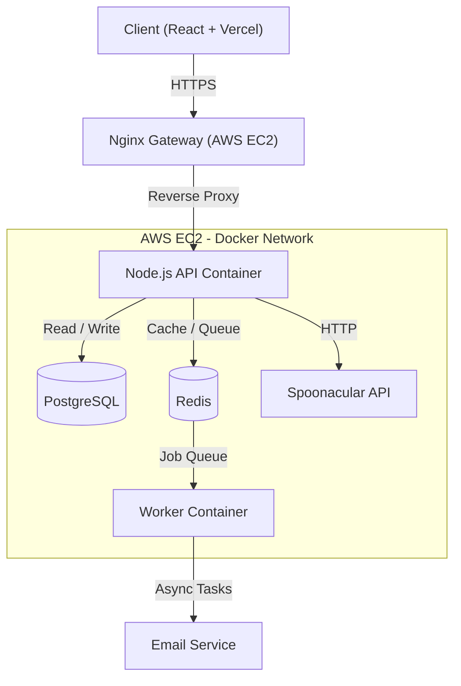

# Meal Match 🥘

A **distributed, containerized Full Stack application** for recipe management, deployed on **AWS EC2**.

**Meal Match** is a production-grade web application that allows users to find recipes based on available ingredients. This project focuses on **backend scalability, resilience, and DevOps automation**.

🚀 **Live Demo:** [https://meal-match.duckdns.org](https://meal-match-kappa.vercel.app/)

---

## 🏗 System Architecture

The application implements a **Microservices-lite architecture** using **Docker Compose**.  
It separates the high-throughput API from background worker processes to ensure **non-blocking user operations**.

### Architecture Diagram (Mermaid)

## 🛠 Tech Stack

**Frontend:** React, TypeScript, TailwindCSS, Vite (Deployed on Vercel)

**Backend:** Node.js, Express, TypeScript (Deployed on AWS EC2)

**Database:** PostgreSQL (Relational Data), Redis (Caching & Queues)

**Infrastructure:** Docker, Docker Compose, Nginx (Reverse Proxy), Linux (Ubuntu)

**DevOps:** GitHub Actions (CI/CD), Certbot (SSL)

---

## 🌟 Key Engineering Features

### 1. Distributed Caching (Redis)
To reduce latency and external API costs, search results from Spoonacular are cached in Redis with a TTL (Time-To-Live).

**Result:** API response time reduced from ~400ms to ~5ms for frequent queries.

---

### 2. Asynchronous Background Jobs (BullMQ)
Heavy operations (like sending welcome emails) are offloaded to a background worker using a message queue.

**Result:** User registration is instantaneous; the API does not block while waiting for email service providers.

**Resilience:** If the Worker crashes, jobs persist in Redis and are retried automatically.

---

### 3. Rate Limiting & Security
**Fixed Window Counter:** Custom middleware limits requests per IP using Redis atomic increments to prevent abuse.

**Security:** JWT Authentication, BCrypt password hashing, and Environment Variable injection via Docker.

---

### 4. Containerization & DevOps
**Docker Compose:** Orchestrates 4 services (API, Worker, DB, Redis) with a single command.

**Multi-Stage Builds:** Dockerfiles use multi-stage builds to create lightweight production images (stripping out TypeScript compilers).

**CI Pipeline:** GitHub Actions automatically verifies build integrity on every push.

---

## 🚀 How to Run Locally

**Prerequisites:** Docker Desktop installed.

### 1. Clone the Repository

```bash
git clone https://github.com/ankhanhdau/meal-match.git
cd meal-match
```
### 2. Configure Environment Create a .env file in the root directory
```bash
DB_USER=postgres
DB_PASSWORD=password123
DB_NAME=meal_match
SPOONACULAR_API_KEY=your_key_here
JWT_SECRET=supersecret
```
### 3. Start Services
```bash
docker compose up -d --build
```
### 4. Access the App
- API: http://localhost:3001
- Frontend: http://localhost:5173 (Run cd client && npm run dev)
